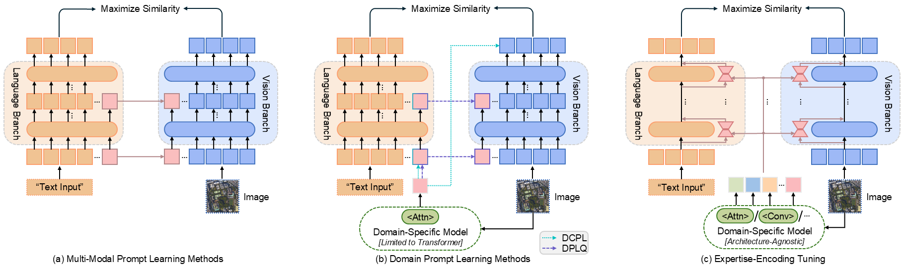

# EET

Official implementation of EET: Expertise-Encoding Tuning for Domain-Specialized Few-Shot Transfer Learning

---
## Abstract


Few-shot transfer learning with vision-language models (VLMs) is a challenging task, particularly when adapting to domains with significant distribution shifts (e.g., from natural images to remote sensing or medical imaging). Most recent works incorporate domain-specific models to guide the learnable embedded prompts, which can only achieve minor adaptations due to restricted tuning in VLMs and limited knowledge extracted from the final layers of architecture-constrained domain models, and thus deliver suboptimal performance. To address these issues, we propose Expertise-Encoding Tuning (EET), a novel approach that encodes multi-layer expertise from a domain-specific model of any architecture into a set of domain adaptive tuning parameters for all layers of VLMs. The framework introduces Hierarchical Knowledge Summarization (HKS), which integrates domain-relevant features into a comprehensive expertise knowledge. The domain knowledge then guides a knowledge-based parameter generator to produce domain adaptive tuning parameters for each attention module in the VLMs. This facilitates fine-grained feature adaptation across the entire network, thereby preserving generalization, mitigating overfitting risks, and establishing strong transfer learning capability, particularly in scenarios with large domain shifts. Extensive experiments on remote sensing and medical imaging demonstrate that our method consistently outperforms state-of-the-art approaches.


---
## Install
```bash
# We work on pytorch=1.10.1, cuda=11.3, and python=3.8. Please change freely with your enviroment.
conda create -y -n eet python=3.8
conda activate eet
pip install torch==1.10.1+cu113 torchvision==0.11.2+cu113 torchaudio==0.10.1

# Dassl
cd Dassl.pytorch/
pip install -r requirements.txt
python setup.py develop

# EET
cd ..
pip install -r requirements.txt
```

## Prepare Your Data
All data used in this study are publicly available under open-source licenses. We suggest putting all datasets under the same folder (say `$DATA`) to ease management and following the instructions below to organize datasets to avoid modifying the source code. The file structure looks like:

```
$DATA/
|–– DATASET/
|   |--images/
|   |   |--ClassA/
|   |   |   |--*.jpg
|   |   |--...
|   |--annotations.json 
|–– ...
```
Notice that you may need to modify or create a configs/datasets/*.yaml file for your custom dataset accordingly.

For the checkpoints of domain-specific models, please download from their corresponding sources. We provide feature extraction code for all models except [MedSAM](https://github.com/bowang-lab/MedSAM), a domain-specific Vision Transformer (ViT) model for medical imaging. For MedSAM, please refer to the official repository and follow its guidelines for implementation.

## Training and Evaluation
The following process is generalizable to all trainers, and here we take EET_RS_ViTAE (Remote Sensing domain-specific model in ViTAE-architecture) as an example.
### (1) Base-to-Novel generalization
The default training settings are provided in config file at `configs/trainers/EET_rs_vitae/vit_b16_c2_ep5_batch4_2ctx.yaml`. All hyper-parameters can be modified using this config file.

Below, we provide instructions to train EET. 

```bash
# SEED=1,2,3
# trains and evaluates on base classes
bash scripts/eet_rs_vitae/base2new_train_eet_rs_vitae.sh ${DATASET} ${SEED}
# evaluates on novel classes
bash scripts/eet_rs_vitae/base2new_test_eet_rs_vitae.sh ${DATASET} ${SEED}
```

### (2) Cross-Dataset Transfer
We provide cross-dataset config : `configs/EET_rs_vitae/vit_b16_c2_ep5_batch4_2ctx_cross_datasets.yaml`.
* Firstly, train EET on the source dataset in few-shot manner.
```bash
bash scripts/eet_rs_vitae/xd_train_eet_rs_vitae.sh ${DATASET} ${SEED}
```
* Now evaluate this model on all other datasets.

```bash
bash scripts/eet_rs_vitae/xd_test_eet_rs_vitae.sh ${DATASET} ${SEED}
```

### (3) Domain Generalization 
 The steps are similar to the above cross-dataset experiments, however, the trained model is evaluated on the entire generalization datasets (v2).
```bash
bash scripts/eet_rs_vitae/xd_test_eet_rs_vitae.sh ${DATASETv2} ${SEED}
```

## Acknowledgement
Our code is based on [MaPLe](https://github.com/muzairkhattak/multimodal-prompt-learning) repository. We thank the authors for releasing their code.